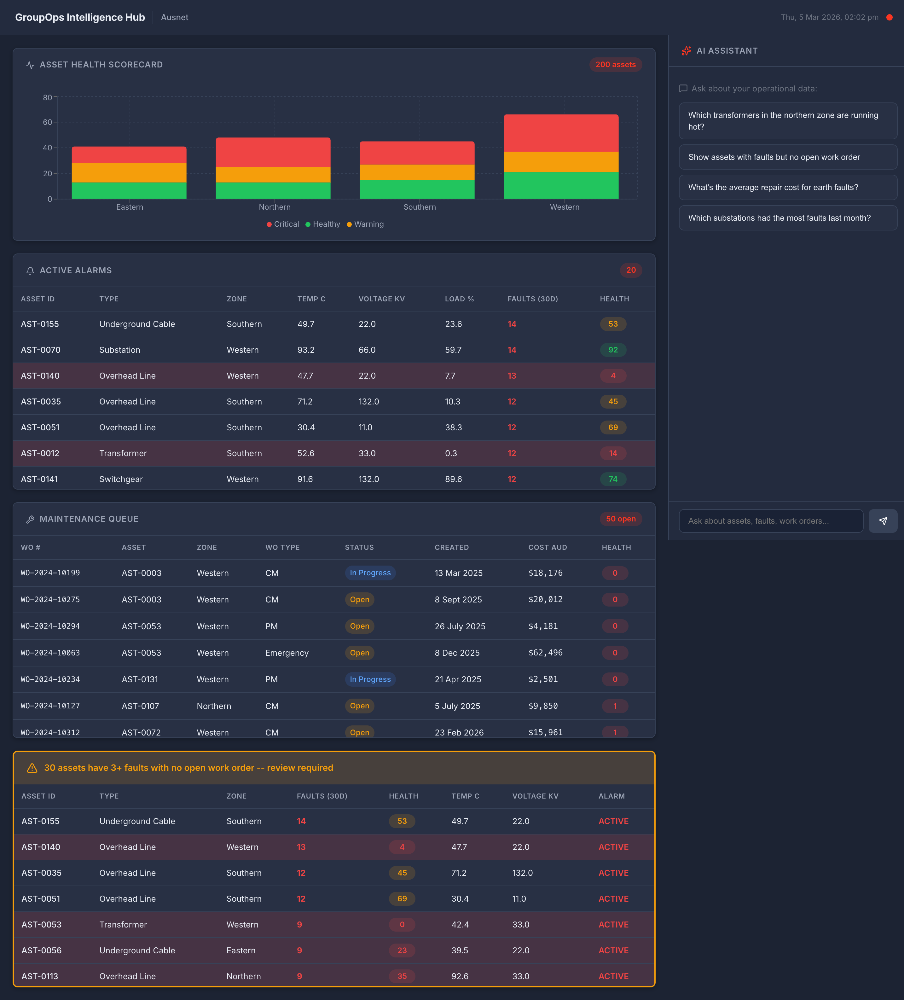
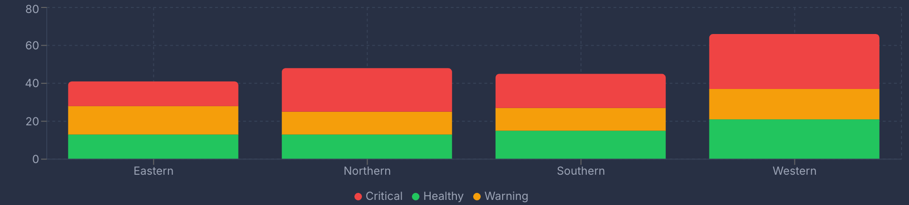
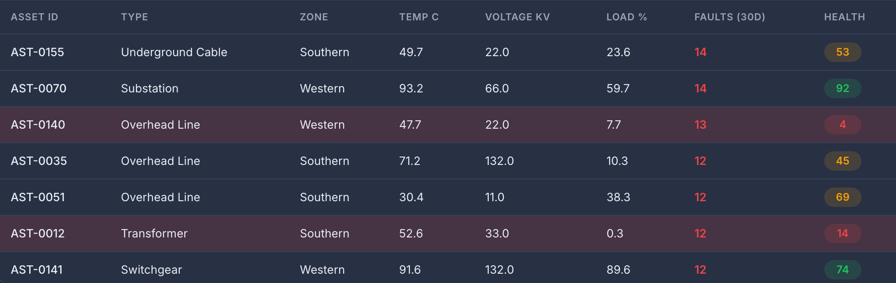
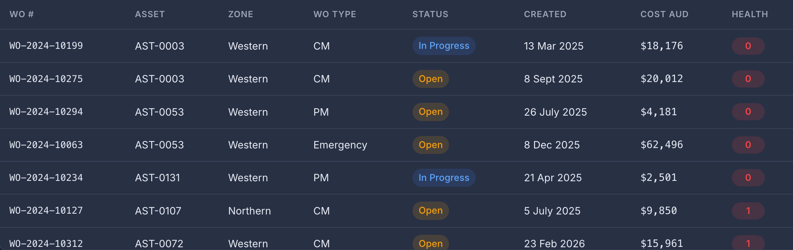
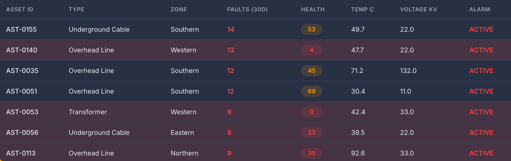
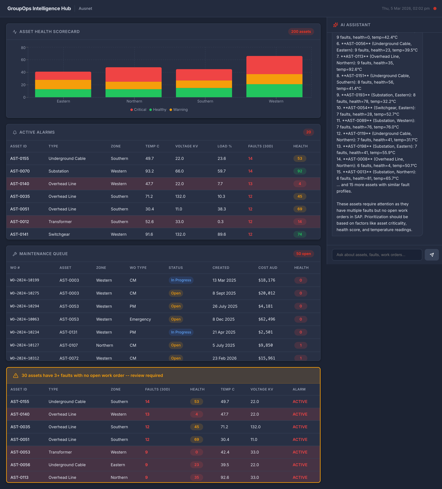
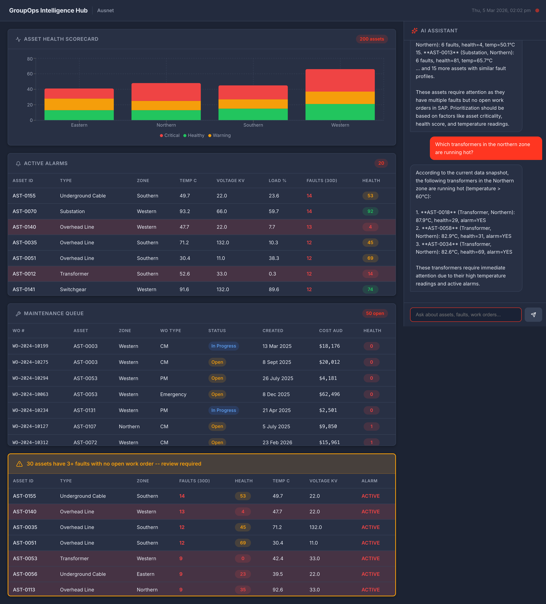

# GroupOps Intelligence Hub

> **A Databricks App for energy and utilities Group Operations teams** — unifying SAP and AVEVA data into a single operational intelligence platform with AI-assisted querying.



---

## The Problem

A typical energy and utilities GroupOps team manages electricity and gas distribution infrastructure across multiple geographic zones. Their operational data lives in two completely disconnected systems:

| System | What it holds |
|--------|--------------|
| **SAP** | Asset master records, PM/CM/Emergency work orders, maintenance history, costs |
| **AVEVA** | Real-time sensor historian — voltage, current, temperature, fault events, alarms |

**The gap:** Operators cannot answer cross-system questions without manual effort. The most critical: *"Which assets have 3+ fault events this month with no open SAP work order?"* — assets that are actively failing with nobody assigned to fix them.

---

## The Solution

A Databricks-powered **GroupOps Intelligence Hub** that:

1. **Unifies** SAP + AVEVA data into Gold Delta tables under Unity Catalog
2. **Surfaces** operational insights through a purpose-built dashboard
3. **Answers** natural language questions via embedded AI chat (Llama 3.3 70B via Databricks Foundation Model API)
4. **Enables** free-form SQL exploration through a Genie Space

---

## Dashboard

The app is a two-column layout: operational panels on the left, AI chat on the right.

### Asset Health Scorecard



A stacked bar chart showing **healthy / warning / critical** asset counts by zone. Healthy = health score ≥ 70, Warning = 40–69, Critical < 40. Lets the operations manager see at a glance which zones are under stress.

### Active Alarms Panel



Live feed of assets with active AVEVA alarms, ranked by fault count. Shows asset ID, type, zone, temperature (°C), voltage (kV), load % and health score. Rows tinted red for critical assets.

### Maintenance Queue



Open and in-progress SAP work orders enriched with asset health scores. Health score shown as a colour-coded badge (green / amber / red) so engineers can prioritise the most at-risk assets.

### Fault vs WO Gap — The Key Insight



**The centrepiece of the demo.** An amber-bordered alert panel that surfaces assets with 3+ fault events in the last 30 days but **no open SAP work order**. These are assets that AVEVA knows are failing, but SAP has no remediation underway. In a live environment, this represents real operational risk.

---

## AI Chat Assistant



An embedded AI chat panel backed by **Databricks Foundation Model API** (Llama 3.3 70B). The backend enriches each question with a targeted SQL query before calling the LLM — so answers contain real asset IDs, temperatures, costs and fault counts, not hallucinations.

### Pre-loaded prompt starters

| Question | What it demonstrates |
|----------|---------------------|
| *Which transformers in the northern zone are running hot?* | Cross-filter by asset type + zone + sensor reading |
| *Show assets with faults but no open work order* | The key SAP ↔ AVEVA gap insight |
| *What's the average repair cost for earth faults?* | Cost analytics joining fault events → work orders |
| *Which substations had the most faults last month?* | Time-windowed aggregation over fault history |



---

## Architecture

```
┌─────────────────────────────────────────────────────┐
│           Synthetic Data Generation                  │
│         (Faker + PySpark — scripts/)                 │
└────────────────────┬────────────────────────────────┘
                     ↓
┌─────────────────────────────────────────────────────┐
│         Gold Delta Tables — Unity Catalog            │
│  ┌──────────────────────┬───────────────────────┐   │
│  │  asset_health_360    │     fault_events       │   │
│  │  (200 assets)        │     (1,000 events)     │   │
│  ├──────────────────────┼───────────────────────┤   │
│  │  work_orders         │     sensor_trends      │   │
│  │  (400 WOs)           │     (18,200 rows)      │   │
│  └──────────────────────┴───────────────────────┘   │
│        (groupops.asset_health_360, fault_events…)    │
└──────────────┬──────────────────────┬───────────────┘
               ↓                      ↓
   ┌───────────────────┐   ┌─────────────────────┐
   │   Databricks App  │   │    Genie Space       │
   │  (GroupOps Hub)   │   │  (NL SQL queries)    │
   │  FastAPI + React  │   │  5 demo questions    │
   └───────────────────┘   └─────────────────────┘
```

---

## Data Model

### `asset_health_360` — Main gold table (200 rows)

| Column | Type | Description |
|--------|------|-------------|
| `asset_id` | STRING | Primary key (`AST-0001` … `AST-0200`) |
| `asset_type` | STRING | Transformer / Substation / Overhead Line / Underground Cable / Switchgear |
| `zone` | STRING | Northern / Eastern / Southern / Western |
| `health_score` | INT | 0–100 composite score (inversely correlated with faults/alarms) |
| `fault_count_30d` | INT | AVEVA fault events in last 30 days |
| `open_wo_count` | INT | Open SAP work orders |
| `latest_temp_c` | FLOAT | Most recent AVEVA temperature reading |
| `latest_voltage_kv` | FLOAT | Most recent AVEVA voltage reading |
| `alarm_active` | BOOLEAN | Active AVEVA alarm flag |
| `sap_plant` | STRING | SAP plant code (AU01 / AU02 / AU03) |
| `cost_centre` | STRING | SAP cost centre |

**Key constraint:** ~15% of assets (`fault_count_30d ≥ 3` AND `open_wo_count = 0`) represent the operational gap the dashboard highlights.

### `fault_events` — AVEVA fault history (1,000 rows)

| Column | Type | Description |
|--------|------|-------------|
| `fault_id` | STRING | UUID |
| `asset_id` | STRING | FK → `asset_health_360` |
| `fault_timestamp` | TIMESTAMP | When the fault occurred |
| `fault_type` | STRING | Overvoltage / Thermal / Earth fault / Phase imbalance / Loss of supply |
| `severity` | STRING | Low / Medium / High / Critical |
| `duration_mins` | INT | Fault duration |
| `resolved` | BOOLEAN | Resolution status |

### `work_orders` — SAP work orders (400 rows)

| Column | Type | Description |
|--------|------|-------------|
| `wo_number` | STRING | SAP WO number |
| `asset_id` | STRING | FK → `asset_health_360` |
| `wo_type` | STRING | PM / CM / Emergency |
| `status` | STRING | Open / In Progress / Completed / Cancelled |
| `cost_aud` | FLOAT | Actual cost in AUD |

### `sensor_trends` — Daily AVEVA aggregations (18,200 rows)

Daily sensor averages per asset across 90 days: `avg_temp_c`, `max_temp_c`, `avg_voltage_kv`, `avg_load_pct`, `fault_count`.

---

## Backend API

| Endpoint | Description |
|----------|-------------|
| `GET /api/health-summary` | Asset counts by health status (healthy/warning/critical) grouped by zone |
| `GET /api/active-alarms` | Top 20 assets with active AVEVA alarms, sorted by fault count |
| `GET /api/maintenance-queue` | Open/in-progress SAP work orders joined with asset health |
| `GET /api/fault-wo-gap` | Assets with `fault_count_30d ≥ 3` AND `open_wo_count = 0` |
| `POST /api/chat` | AI chat — context-aware SQL enrichment + Llama 3.3 70B response |

The chat endpoint detects intent from the user's message and runs a targeted SQL query to inject real data into the LLM context before generating a response.

---

## Genie Space

A [Databricks Genie Space](https://fe-sandbox-serverless-sandbox-beyza.cloud.databricks.com/genie/rooms/01f1182ef2011e7e842b495788150cde) is configured over all 4 gold tables with:

- **Business context** tuned to energy utility asset types, zones, SAP/AVEVA data model
- **5 pre-configured demo questions** with verified SQL answers

| Demo question | SQL highlights |
|--------------|---------------|
| Which substations had the most faults last month? | `GROUP BY` fault count from `fault_events` |
| Show assets with AVEVA alarms but no SAP work order | `alarm_active = true AND open_wo_count = 0` |
| What's the total maintenance cost in the eastern zone this year? | `SUM(cost_aud)` joined by zone |
| Show all assets due for preventive maintenance | `wo_type = 'PM' AND status IN ('Open', 'In Progress')` |
| What's the average repair cost for earth faults? | Join `fault_events` → `work_orders` by asset |

---

## Databricks Features Showcased

| Feature | Energy & Utilities Relevance |
|---------|------------------------------|
| **Unity Catalog** | Governance story — lineage, access control, data discovery across SAP + AVEVA |
| **Delta Lake (Gold tables)** | Replaces their Synapse reporting layer with open, performant format |
| **Databricks App** | Purpose-built GroupOps UI — single pane of glass across both systems |
| **Foundation Model API** | AI chat over operational data without leaving the Databricks platform |
| **Genie Space** | Natural language querying across SAP + AVEVA — the "wow" moment |
| **Serverless SQL** | Zero infrastructure management for warehouse queries |

---

## Project Structure

```
groupops-intelligence-hub/
├── app/
│   ├── app.py              # FastAPI entry point — serves API + static frontend
│   ├── app.yaml            # Databricks App config (OAuth resources)
│   ├── requirements.txt
│   ├── server/
│   │   ├── routes.py       # API endpoint handlers
│   │   ├── db.py           # Databricks SQL connector
│   │   ├── llm.py          # Foundation Model API client + SQL context enrichment
│   │   └── config.py       # Auth (local profile vs Databricks App OAuth)
│   └── frontend/
│       └── src/
│           ├── App.tsx
│           ├── components/
│           │   ├── HealthScorecard.tsx   # Recharts stacked bar chart
│           │   ├── ActiveAlarms.tsx      # AVEVA alarm feed table
│           │   ├── MaintenanceQueue.tsx  # SAP work orders table
│           │   ├── FaultWoGap.tsx        # The key insight panel
│           │   └── ChatPanel.tsx         # AI chat with prompt starters
│           └── hooks/
│               └── useApi.ts
├── scripts/
│   └── generate_gold_tables.py          # Synthetic data generation (Faker + PySpark)
├── status/                              # Build tracking docs per workstream
├── prd.md                              # Full product requirements document
└── README.md
```

---

## Running Locally

### Prerequisites
- Python 3.11+
- Node 18+
- Databricks CLI configured with profile `fe-vm-sandbox-serverless-sandbox-beyza`
- Gold tables already created in the `groupops` schema under Unity Catalog

### Backend

```bash
cd app
python -m venv .venv && source .venv/bin/activate
pip install -r requirements.txt
uvicorn app:app --reload --port 8000
```

### Frontend

```bash
cd app/frontend
npm install
npm run dev        # dev server on :5173 with proxy to :8000
```

### Regenerate Gold Tables

```bash
# Upload and run the generation notebook in your Databricks workspace
databricks workspace import scripts/generate_gold_tables.py \
  /Users/<your-user>/groupops-data-gen --profile <your-profile>
```

---

## Deployment

```bash
cd app
databricks sync . /Workspace/Users/<your-user>/groupops-intelligence-hub --profile <profile>
databricks apps deploy groupops-intelligence-hub --profile <profile>
```

The `app.yaml` defines the SQL warehouse and LLM serving endpoint as OAuth resources — no tokens needed at runtime.

---

## Live Demo Links

| Resource | URL |
|----------|-----|
| **Databricks App** | https://ausnet-groupops-hub-7474651325821186.aws.databricksapps.com |
| **Genie Space** | https://fe-sandbox-serverless-sandbox-beyza.cloud.databricks.com/genie/rooms/01f1182ef2011e7e842b495788150cde |
| **Unity Catalog** | `groupops.*` schema on `fe-sandbox-serverless-sandbox-beyza` |
